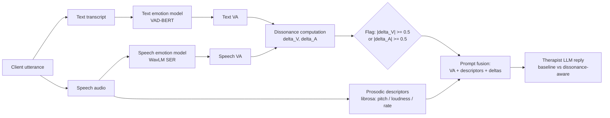

# Luna AI Therapist

**Multimodal Emotional Dissonance for CBT-Oriented Therapist Response Generation**

A thesis repository for **Luna**, a CBT-oriented multimodal dialogue system that compares the emotion a client *says* (text) with the emotion a client *sounds* (speech), detects **emotional dissonance** between the two, and uses that mismatch signal to guide safer, more empathetic, and more context-aware therapist responses.

> **Core claim.** A multimodal emotional dissonance signal (text-vs-speech Valence-Arousal mismatch) helps a CBT dialogue model respond more safely and more appropriately than text-only or naive vocal-aware prompting.
>
> **Framing.** Dissonance is treated as a cue of *hidden, masked, or not-yet-verbalized affect* to explore gently. It is **not** a lie-detection or deception-classification system.

---

## 1. The Problem

A client's spoken words and vocal affect do not always align. A client may say *"I'm okay"* while sounding tense, flat, or distressed. Text-only AI counselors are blind to this gap; naive vocal-feature injection, as this work shows, can even *degrade* therapist quality. The missing ingredient is an explicit **mismatch computation plus a therapeutic framing** of that mismatch.

## 2. Core Method: Threshold-Based Dissonance Pipeline (Implemented)



**Dissonance score (original rule):**

```
dissonant  <=>  |V_speech - V_text| >= 0.5  OR  |A_speech - A_text| >= 0.5
```

The continuous deltas are additionally supplied on **every** turn with interpretive guidance ("large |delta| means tone and words pull in different directions; explore gently"), which the v4 experiments identify as the *always-on framing* mechanism carrying the measured effect.

## 3. Experimental Conditions

| Condition | Text VA | Speech VA | Prosodic descriptors | Dissonance delta + framing | Role in the comparison |
|---|:--:|:--:|:--:|:--:|---|
| **Baseline** | – | – | – | – | Text-only prompting, no emotional metadata |
| **Emotion (Text-Only)** | yes | – | – | – | "VA-only performance ceiling" |
| **Multimodal (Vocal-Aware)** | yes | yes | yes | – | Feature injection without mismatch reasoning |
| **Dissonance-Aware** | yes | yes | yes | yes | Proposed framework |

## 4. Pipeline Components

| Stage | Component | Tool / model |
|---|---|---|
| Client simulation | Resist-persona client LLM with conversational memory (v4) | Same backbone as therapist per experiment |
| Text emotion | VAD-BERT regression to Valence-Arousal | `vad-bert` |
| Speech synthesis | Zonos TTS with LLM "Director" (emotion vector + prosody controls, JSON repair + neutral fallback) | `Zonos-v0.1-transformer` |
| Speech emotion | WavLM-based SER predicting VA from audio | `SER-Odyssey-Baseline-WavLM-Multi-Attributes` |
| Prosodic descriptors | Pitch, loudness, speaking rate to natural-language descriptors | `librosa` |
| Dissonance | Per-dimension deltas + fixed threshold flag (0.5) | This repository |
| Therapist | Frozen LLM, condition-specific prompt injection (no fine-tuning) | 4 backbones (below) |

## 5. The v4 Experiment at a Glance

**Design:** 4 backbones x 4 conditions x 100 shared problem seeds = **1,600 complete sessions** (10 turns each), completeness-verified; all comparisons paired per seed.

| Backbone | Type | Note |
|---|---|---|
| `gpt-4o-mini` | Closed, dense | Largest measurable headroom |
| `claude-sonnet-4.6` | Closed, dense | Near judge ceiling |
| `qwen-2.5-72b-instruct` | Dense, open | Strong text-only baseline |
| `deepseek-chat` (V3.2) | MoE, open | Absolute scale saturates |

**Evaluation protocol (three layers + reliability):**

| Layer | Instrument | Scope |
|---|---|---|
| 1. Absolute grading | Blind GPT-4o judge (temp 0), 7 metrics: Understanding, Interpersonal Effectiveness (MIRROR), Affective Bond (WAI), CTRS Collaboration / Guided Discovery / Focus / Strategy | 1,600 sessions |
| 2. Paired statistics | Per-seed paired deltas + paired t-tests on the 7-metric total | 100 pairs per backbone-condition comparison |
| 3. Pairwise preference | Forced choice A/B/tie, two-order swap consistency (Zheng et al., 2023), exact sign test, pre-registered criteria | 800 comparisons x 2 orders |
| Reliability | Cross-family second judge (Claude Sonnet 4.6), Cohen's kappa + directional agreement; position consistency; verbosity audit | Stratified 100-comparison subset |

## 6. Headline Results (v4)

Delta = Dissonance-Aware minus Baseline per metric (Layer 1); pairwise net win-rate from the swap-consistent Layer 3 (`**` = sign-test p < 0.05).

| Backbone | Avg delta vs Baseline | Pairwise vs Baseline | Pairwise vs Multimodal | Verdict |
|---|:--:|:--:|:--:|---|
| GPT-4o mini | **+0.14** | **0.680** | **0.800** | Highest on all 7 metrics; significant on CTRS craft (G +0.24, F +0.34, S +0.17) |
| DeepSeek V3.2 | +0.02 | **0.660** | 0.520 | Absolute scale saturates; pairwise recovers a real preference (p = 0.00004) |
| Qwen-2.5-72B | -0.06 | 0.475 (n.s.) | 0.555 | Honest neutral vs Baseline; still beats Multimodal and Emotion |
| Claude Sonnet 4.6 | -0.04 | 0.495 (ties) | 0.500 (ties) | All conditions indistinguishable at judge ceiling |

**Mechanistic finding (the thesis' sharpest result).** With *identical* vocal inputs but *without* the dissonance computation and framing, the Multimodal condition **regressed below the text-only Baseline** on both weaker backbones (GPT-4o mini total t = -4.75; Qwen t = -6.13), while Dissonance-Aware turned the same inputs into gains (GPT-4o mini vs Multimodal: +2.75 total, t = 7.94; pairwise 0.800 with dissonance transcripts on average 1,310 characters *shorter*). Raw vocal metadata is not intrinsically therapeutic; the dissonance reasoning layer is what converts vocal signals into clinical value.

**Cost.** Dissonance-Aware adds ~21.9 s per dialogue (+29%) over Baseline (97.3 s vs 75.4 s on Claude), dominated by longer deliberative therapist responses plus WavLM/librosa extraction; the dissonance computation itself is under 0.01 s.

## 7. Repository Structure

| Path | Contents |
|---|---|
| `dissonance/` | Main pipeline: v4 generation scripts (`run_*_v4.py`), `evaluation/` (Layer 1-3 scripts, reports, outputs), `multibackbone/` (1,600 session artifacts), `inference_time/`, demos |
| `latex/` | Thesis chapters (`00-abstract` ... `07-conclusion`, appendix, references) |
| `slide/` | Defense slides; `slide/latex_table/` standalone LaTeX tables |
| `core_zonos/` | Zonos TTS engine (speech synthesis with Director) |
| `auto_speech_recog/` | Speech recognition / audio utilities |
| `generated_cbt_params/` | Generated CBT scenario parameters and seeds |
| `Feedbacks/` | Advisor feedback and revision notes |
| `wagner/` | Early single-dialogue experiments (pre-v4 lineage) |
| `AGENTS.md` | Operating rules and research-scope guide for coding agents |

## 8. Reproducing the v4 Runs

```bash
# install dependencies
pip install -r requirements.txt        # or: uv sync

# generation (per backbone / condition; example)
python dissonance/run_dissonance_multibackbone_v4.py --model gpt4o-mini --start 1 --end 100
python dissonance/run_multibackbone_baseline_v4.py   --model gpt4o-mini --start 1 --end 100
python dissonance/run_multibackbone_emotion_v4.py    --model gpt4o-mini --start 1 --end 100
python dissonance/run_multibackbone_multimodal_v4.py --model gpt4o-mini --start 1 --end 100

# completeness verification
python dissonance/check_dialogue_completeness.py --backbone all --v4-era --end 100

# Layer 1: absolute grading (1,600 sessions)
python dissonance/evaluation/evaluate_multibackbone_final.py --start 1 --end 100

# Layer 3: pairwise preference (800 comparisons x 2 orders + 100 second-judge)
python dissonance/evaluation/evaluate_pairwise.py --resume
```

Key artifacts: `dissonance/evaluation/ai_multibackbone_report_v4.md` (full report), `dissonance/evaluation/evaluation_outputs/` (per-layer JSONL), `dissonance/evaluation/evaluation_outputs/pairwise_summary.md`.

## 9. Safe Therapeutic Stance

The therapist prompt and all reporting follow a non-accusatory, exploratory stance:

| Preferred | Avoided |
|---|---|
| "I sense there may be some discomfort here." | "You are lying." |
| "You said you are okay, but it sounds like this may still feel heavy." | "You are hiding the truth." |
| "Would you like to tell me more about what made that difficult?" | "Your statement is false." |

Terminology policy: prefer *emotional dissonance*, *hidden affect*, *masked emotion*, *therapist exploration*; avoid *lie detection*, *deception classification*, *truth verification* outside related-work discussion. A safety scan found accusatory phrasing in ~0.01% of therapist turns, evenly distributed across conditions.

## 10. Future Work (Not Implemented)

Clearly separated from the implemented contribution:

1. **Multimodal information disentanglement** (shared / unique / synergy over text+speech) to reduce false alarms.
2. **Adaptive fusion / adaptive threshold** replacing the fixed 0.5 rule with session-context-sensitive sensitivity.
3. **SEPSIS-inspired dissonance reasoner**: omission-style text reasoning run only on flagged turns, reframed therapeutically (why affect may be masked, where to probe gently), never as forensic deception detection.
4. **Human expert validation** of the existing pairwise comparisons (MIRROR-style clinician study) and **real-voice replay** with controlled mismatch manipulation.

## 11. Key References

- Kim et al. (2025). MIRROR: Multimodal Cognitive Reframing Therapy for Rolling with Resistance. *EMNLP 2025*.
- Haydarov et al. (2025). Towards AI-Assisted Psychotherapy: Emotion-Guided Generative Interventions. *EMNLP 2025*.
- Zheng et al. (2023). Judging LLM-as-a-Judge with MT-Bench and Chatbot Arena. *NeurIPS 2023 D&B*.
- Shi et al. (2025). Judging the Judges: A Systematic Study of Position Bias in LLM-as-a-Judge. *AACL-IJCNLP 2025*.
- Lee et al. (2024). CACTUS: Towards Psychological Counseling Conversations using CBT. *Findings of EMNLP 2024*.
- Wu et al. (2025). Beyond Silent Letters: Amplifying LLMs in Emotion Recognition with Vocal Nuances. *Findings of NAACL 2025*.
- Young & Beck (1980). Cognitive Therapy Scale Rating Manual. Beck Institute.
- Horvath & Greenberg (1989). Development and Validation of the Working Alliance Inventory. *Journal of Counseling Psychology*.
- Hochschild (1983). The Managed Heart: Commercialization of Human Feeling. UC Press.

Full bibliography: `latex/08-references.bib`.

---

*Operating rules for coding agents (no executing generated .py/.ipynb, mandatory `.bak` backups, no git commands by agents) are defined in [`AGENTS.md`](AGENTS.md).*
